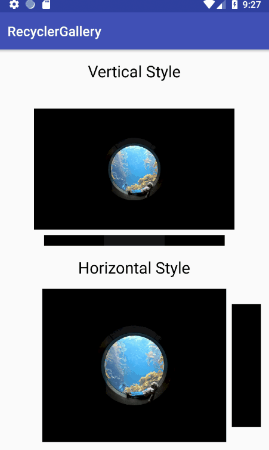

# RecyclerGallery
## Preview

## How to use ?
### Gadle
```
implementation 'com.ray:recyclergallery:1.0.0'
```
### Layout xml
```
<com.ray.lib.GalleryRecyclerView
      android:id="@+id/recycler"
      android:layout_width="match_parent"
      android:layout_height="wrap_content" />
```
### Customize
It's just like the regular RecyclerView.<br/>
and you can customize it with following codes. <br/>
**NOTICE! Don't set Layoutmanager or add ItemDecoration for GalleryRecyclerView!**
```
  GalleryRecyclerView galleryRecyclerView = findViewById(R.id.recycler);
        galleryRecyclerView.setDividerSize((int) TypedValue.applyDimension(TypedValue.COMPLEX_UNIT_DIP, 8, getResources().getDisplayMetrics()));
        galleryRecyclerView.setOrientation(LinearLayoutManager.HORIZONTAL);
        galleryRecyclerView.setScaleFactor(0.8f);
        galleryRecyclerView.setItemShowRatio(0.2f);
```
Have Fun. Bye
